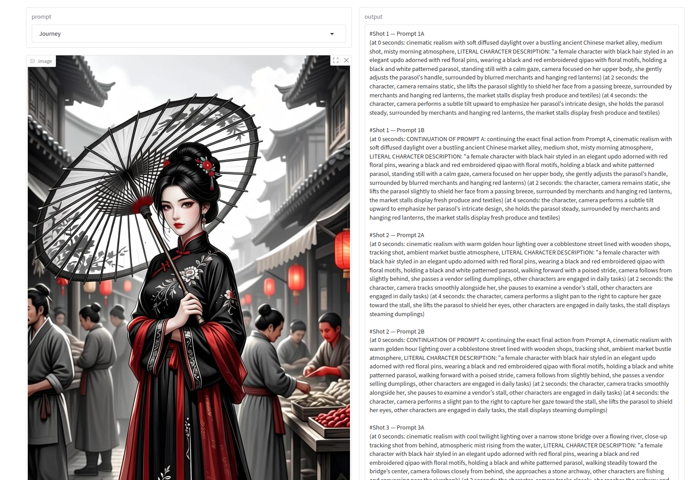

# SVIPromptEnhancer
Creates prompts from image for long video generation

## Installation

```
https://github.com/noodlepopllc/SVIPromptEnhancer.git
cd SVIPromptEnhancer

uv run SVIPro2_prompter.py --gui
```



This can also be installed via virtual env and pip

```
python -m venv .venv
source .venv/bin/activate
pip install -r requirements.txt
python SVIPro2_prompter.py -i Images/ancient_china.jpg -p Journey
python SVIPro2_prompter.py -i Images/battle.jpg -p Action
```

Journey will give a shot list that has the character transition from one point to another.

Action will use objects and characters in the scene to interact with, and is best if you don't want the location to change
or you want character interactions with one another.

It creates 2 actions per character, 3 shots per action

Both create prompts that aid in character consistency.
